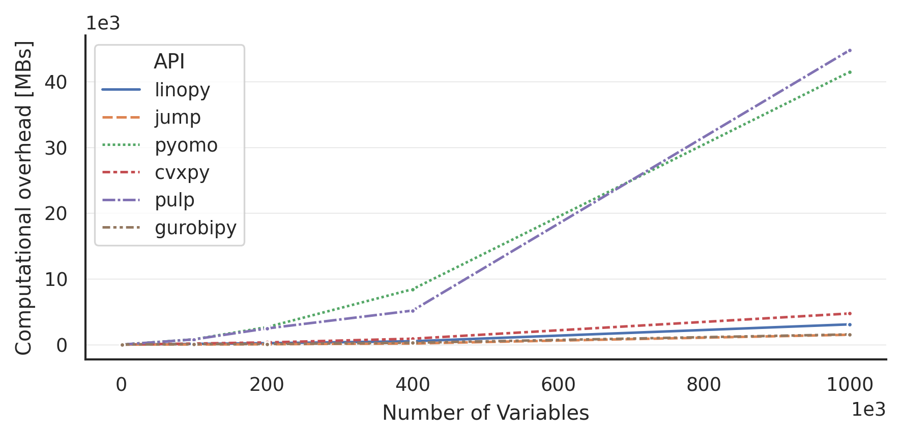

# linopy: Optimization with array-like variables and constraints

[](https://pypi.org/project/linopy/)
[](LICENSE.txt)
[](https://github.com/PyPSA/linopy/actions/workflows/test.yml)
[](https://linopy.readthedocs.io/en/latest/)
[](https://codecov.io/gh/PyPSA/linopy)


&nbsp; &nbsp; &nbsp; &nbsp; **L**inear\
&nbsp; &nbsp; &nbsp; &nbsp; **I**nteger\
&nbsp; &nbsp; &nbsp; &nbsp; **N**on-linear\
&nbsp; &nbsp; &nbsp; &nbsp; **O**ptimization in\
&nbsp; &nbsp; &nbsp; &nbsp; **PY**thon

**linopy** is an open-source python package that facilitates **optimization** with **real world data**. It builds a bridge between data analysis packages like [xarray](https://github.com/pydata/xarray) & [pandas](https://pandas.pydata.org/) and problem solvers like [cbc](https://projects.coin-or.org/Cbc), [gurobi](https://www.gurobi.com/) (see the full list below). **Linopy** supports **Linear, Integer, Mixed-Integer and Quadratic Programming** while aiming to make linear programming in Python easy, highly-flexible and performant.


## Benchmarks

**linopy** is designed to be fast and efficient. The following benchmark compares the performance of **linopy** with the alternative popular optimization packages.




## Main features

**linopy** is heavily based on [xarray](https://github.com/pydata/xarray) which allows for many flexible data-handling features:

* Define (arrays of) continuous or binary variables with **coordinates**, e.g. time, consumers, etc.
* Apply **arithmetic operations** on the variables like adding, substracting, multiplying with all the  **broadcasting** potentials of xarray
* Apply **arithmetic operations** on the **linear expressions** (combination of variables)
* **Group terms** of a linear expression by coordinates
* Get insight into the **clear and transparent data model**
* **Modify** and **delete** assigned variables and constraints on the fly
* Use **lazy operations** for large linear programs  with [dask](https://dask.org/)
* Choose from **different commercial and non-commercial solvers**
* Fast **import and export** a linear model using xarray's netcdf IO


## Installation

So far **linopy** is available on the PyPI repository

```bash
pip install linopy
```

or on conda-forge

```bash
conda install -c conda-forge linopy
```

## In a Nutshell

Linopy aims to make optimization programs transparent and flexible. To illustrate its usage, let's consider a scenario where we aim to minimize the cost of buying apples and bananas over a week, subject to daily and weekly vitamin intake constraints.


```python
>>> import pandas as pd
>>> import linopy

>>> m = linopy.Model()

>>> days = pd.Index(["Mon", "Tue", "Wed", "Thu", "Fri"], name="day")
>>> apples = m.add_variables(lower=0, name="apples", coords=[days])
>>> bananas = m.add_variables(lower=0, name="bananas", coords=[days])
>>> apples
```
```
Variable (day: 5)
-----------------
[Mon]: apples[Mon] ∈ [0, inf]
[Tue]: apples[Tue] ∈ [0, inf]
[Wed]: apples[Wed] ∈ [0, inf]
[Thu]: apples[Thu] ∈ [0, inf]
[Fri]: apples[Fri] ∈ [0, inf]
```

Add daily vitamin constraints

```python
>>> m.add_constraints(3 * apples + 2 * bananas >= 8, name="daily_vitamins")
```
```
Constraint `daily_vitamins` (day: 5):
-------------------------------------
[Mon]: +3 apples[Mon] + 2 bananas[Mon] ≥ 8
[Tue]: +3 apples[Tue] + 2 bananas[Tue] ≥ 8
[Wed]: +3 apples[Wed] + 2 bananas[Wed] ≥ 8
[Thu]: +3 apples[Thu] + 2 bananas[Thu] ≥ 8
[Fri]: +3 apples[Fri] + 2 bananas[Fri] ≥ 8
```

Add weekly vitamin constraint

```python
>>> m.add_constraints((3 * apples + 2 * bananas).sum() >= 50, name="weekly_vitamins")
```
```
Constraint `weekly_vitamins`
----------------------------
+3 apples[Mon] + 2 bananas[Mon] + 3 apples[Tue] ... +2 bananas[Thu] + 3 apples[Fri] + 2 bananas[Fri] ≥ 50
```

Define the prices of apples and bananas and the objective function

```python
>>> apple_price = [1, 1.5, 1, 2, 1]
>>> banana_price = [1, 1, 0.5, 1, 0.5]
>>> m.objective = apple_price * apples + banana_price * bananas
```

Finally, we can solve the problem and get the optimal solution:

```python
>>> m.solve()
>>> m.objective.value
```
```
17.166
```

... and display the solution as a pandas DataFrame
```python
>>> m.solution.to_pandas()
```
```
        apples  bananas
day
Mon    2.667      0
Tue    0          4
Wed    0          9
Thu    0          4
Fri    0          4
```
## Supported solvers

**linopy** supports the following solvers

* [Cbc](https://projects.coin-or.org/Cbc)
* [GLPK](https://www.gnu.org/software/glpk/)
* [HiGHS](https://www.maths.ed.ac.uk/hall/HiGHS/)
* [Gurobi](https://www.gurobi.com/)
* [Xpress](https://www.fico.com/en/products/fico-xpress-solver)
* [Cplex](https://www.ibm.com/de-de/analytics/cplex-optimizer)
* [MOSEK](https://www.mosek.com/)
* [COPT](https://www.shanshu.ai/copt)

Note that these do have to be installed by the user separately.

## Development Setup

To set up a local development environment for linopy and to run the same tests that are run in the CI, you can run:

```sh
python -m venv venv
source venv/bin/activate
pip install uv
uv pip install -e .[dev,solvers]
pytest
```

The `-e` flag of the install command installs the `linopy` package in editable mode, which means that the virtualenv (and thus the tests) will run the code from your local checkout.

## Citing Linopy

If you use Linopy in your research, please cite the following paper:

- Hofmann, F., (2023). Linopy: Linear optimization with n-dimensional labeled variables.
Journal of Open Source Software, 8(84), 4823, [https://doi.org/10.21105/joss.04823](https://doi.org/10.21105/joss.04823)

A BibTeX entry for LaTeX users is

```latex
@article{Hofmann2023,
    doi = {10.21105/joss.04823},
    url = {https://doi.org/10.21105/joss.04823},
    year = {2023}, publisher = {The Open Journal},
    volume = {8},
    number = {84},
    pages = {4823},
    author = {Fabian Hofmann},
    title = {Linopy: Linear optimization with n-dimensional labeled variables},
    journal = {Journal of Open Source Software}
}
```


## License

Copyright 2021 Fabian Hofmann


This package is published under MIT license. See [LICENSE.txt](LICENSE.txt) for details.
