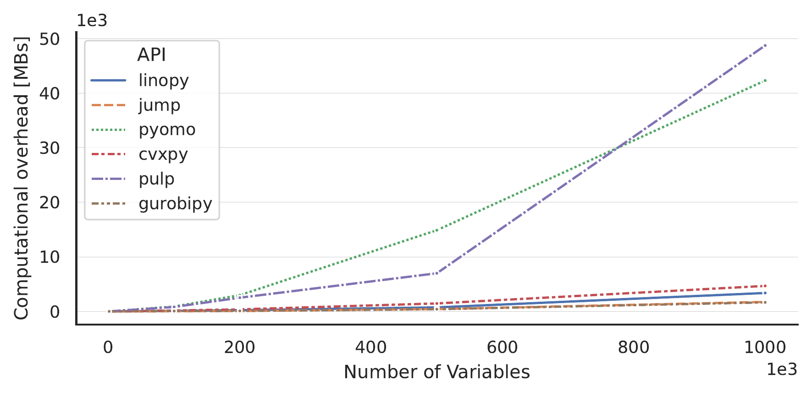

# Benchmark



This benchmark compares the performance of `linopy` against similar packages considering memory and time overhead for solving an optimization problem with N variables. The overhead is defined by the resources needed to define the problem, pass it to the solver and retrieve the solution. For the sake of reproducibility, this directory contains all necessary code in a Snakemake workflow. The workflow allows to choose between two different optimization problems to be used in the benchmarking:

1. A one-dimensional knapsack problem, a standard linear program following the formulation described in [here](https://www.wikiwand.com/en/Knapsack_problem). The figure above was created using this problem for benchmarking. The problem is solved for a range of different values `N` representing the number of variables.

2. The second problem choice `"basic"` is a simple linear program with the following formulation
    <p><span class="math display">∑<sub><em>i</em>, <em>j</em></sub>2<em>x</em><sub><em>i</em>, <em>j</em></sub> + <em>y</em><sub><em>i</em>, <em>j</em></sub></span></p>

    s.t.

    <span class="math display"><em>x</em><sub><em>i</em>, <em>j</em></sub> − <em>y</em><sub><em>i</em>, <em>j</em></sub> ≥ <em>i</em>   ∀ <em>i</em>, <em>j</em> ∈ {1, ..., <em>N</em>}</span>

    <span class="math display"><em>x</em><sub><em>i</em>, <em>j</em></sub> + <em>y</em><sub><em>i</em>, <em>j</em></sub> ≥ 0   ∀ <em>i</em>, <em>j</em> ∈ {1, ..., <em>N</em>}</span></p>

    which is initialized and solved for different values of `N` with each of the API's.


To run the benchmark, install the conda environment with

```bash
conda env create -f environment.yaml
conda activate linopy-benchmark
```

Replace `environment.yaml` by `environment.fixed.yaml` if you want to use the fixed versions of the packages used for creating the figure above. Important package version are specified below.
Make sure to have a working installation of `Julia` and `JuMP`, and optionally install the version stated below.

Then, run the benchmark with

```bash
snakemake --cores 4
```
This will call `snakemake` with 4 cores and finally reproduce the figure above together with other figures in the directory `benchmark/<model-name>`.

### Versions Specfications

For creating the figure above, the following versions of the packages were used

- python v3.9.0
- cxvpy v1.3
- gurobipy v10.0
- pulp v2.7
- Pyomo v6.4.4
- ortools v9.5
- linopy v0.1.3
- julia v1.6.7
- JuMP v1.1.1

For a full list of all python packages see the `environment.fixed.yaml`. The benchmark was performed on a machine with the following specifications

- CPU: AMD Ryzen 7 PRO 6850U with Radeon Graphics
- RAM: 32 GB
- OS: Ubuntu 22.04 LTS
