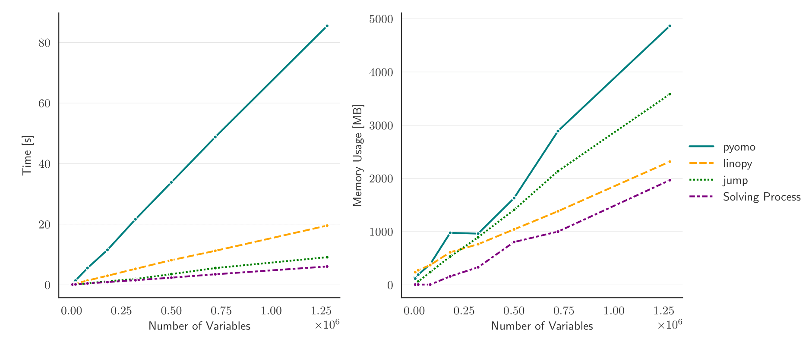

.. _benchmark:

Benchmarks
==========

Linopy's performance scales well with the problem size. Its overall speed is comparable with the famous `JuMP <https://jump.dev/>`_ package written in `Julia <https://julialang.org/>`_. It even outperforms `JuMP` in total memory efficiency when it comes to large models. Compared to `Pyomo <https://pyomo.org>`_, the common optimization package in python, one can expect

* a **speedup of times 4-6**
* a **memory reduction of roughly 50%**

for large problems. The following figure shows the memory usage and speed for solving the problem

.. math::

    & \min \;\; \sum_{i,j} 2 x_{i,j} \; y_{i,j} \\
    s.t. & \\
    & x_{i,j} - y_{i,j} \; \ge \; i \qquad \forall \; i,j \in \{1,...,N\} \\
    & x_{i,j} + y_{i,j} \; \ge \; 0 \qquad \forall \; i,j \in \{1,...,N\}

with the different API's using the `Gurobi <https://gurobi.com>`_ solver. The workflow, that produces the figure, can be found `here <https://github.com/PyPSA/linopy/tree/benchmark/benchmark>`_.

