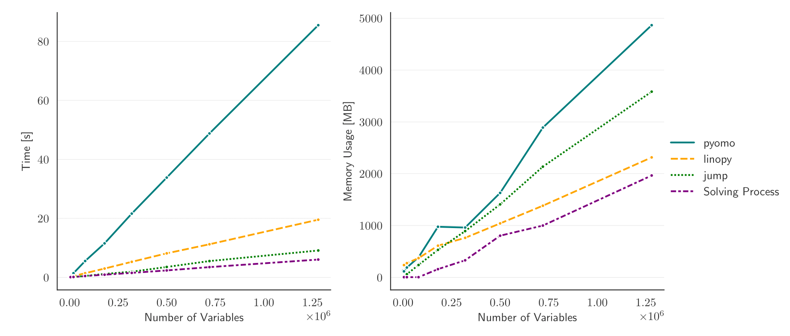

.. _tool-comparison:

Benchmarks and syntax
=====================

This page is for users arriving from JuMP, Pyomo, or GAMS. It reports linopy's
performance against those tools and compares the API surface on a common toy
problem.

- **Porting a Pyomo model?** See :doc:`migrating-from-pyomo` — linopy supports
  Pyomo's rule-function pattern directly.
- **Coming from GAMS?** See :doc:`transport-tutorial` — the classic GAMS
  transport problem worked in linopy alongside the original GAMS syntax.

Performance
-----------

linopy's performance scales well with problem size, comparable to
`JuMP <https://jump.dev/>`_ on speed and ahead of it on memory efficiency for
large models. Against `Pyomo <https://pyomo.org>`_, linopy typically delivers:

* a **speedup of 4–6×**
* a **memory reduction of roughly 50%**

The figure below shows memory usage and build time on the toy problem from the
next section, solved with the `Gurobi <https://gurobi.com>`_ solver. The
benchmark workflow is
`available here <https://github.com/PyPSA/linopy/tree/benchmark/benchmark>`_.

Syntax cheatsheet
-----------------

The benchmark above solves this toy problem:

.. math::

    & \min \;\; \sum_{i,j} 2 x_{i,j} + \; y_{i,j} \\
    s.t. & \\
    & x_{i,j} - y_{i,j} \; \ge \; i-1 \qquad \forall \; i,j \in \{1,...,N\} \\
    & x_{i,j} + y_{i,j} \; \ge \; 0 \qquad \forall \; i,j \in \{1,...,N\}

Here is the same problem in each tool.

**JuMP** (Julia):

.. code-block:: julia

    using JuMP

    function create_model(N)
        m = Model()
        @variable(m, x[1:N, 1:N])
        @variable(m, y[1:N, 1:N])
        @constraint(m, x - y .>= 0:(N-1))
        @constraint(m, x + y .>= 0)
        @objective(m, Min, 2 * sum(x) + sum(y))
        return m
    end

**linopy** (Python):

.. code-block:: python

    from linopy import Model
    from numpy import arange

    def create_model(N):
        m = Model()
        x = m.add_variables(coords=[arange(N), arange(N)])
        y = m.add_variables(coords=[arange(N), arange(N)])
        m.add_constraints(x - y >= arange(N))
        m.add_constraints(x + y >= 0)
        m.add_objective((2 * x).sum() + y.sum())
        return m

The linopy and JuMP formulations are close in spirit: both rely on broadcasting
and array-style operations rather than explicit per-element loops.

**Pyomo** (Python):

.. code-block:: python

    from numpy import arange
    from pyomo.environ import ConcreteModel, Constraint, Objective, Set, Var

    def create_model(N):
        m = ConcreteModel()
        m.N = Set(initialize=arange(N))

        m.x = Var(m.N, m.N, bounds=(None, None))
        m.y = Var(m.N, m.N, bounds=(None, None))

        def bound1(m, i, j):
            return m.x[(i, j)] - m.y[(i, j)] >= i

        def bound2(m, i, j):
            return m.x[(i, j)] + m.y[(i, j)] >= 0

        def objective(m):
            return sum(2 * m.x[(i, j)] + m.y[(i, j)] for i in m.N for j in m.N)

        m.con1 = Constraint(m.N, m.N, rule=bound1)
        m.con2 = Constraint(m.N, m.N, rule=bound2)
        m.obj = Objective(rule=objective)
        return m

Pyomo builds constraints from element-wise rule functions rather than
vectorised expressions. linopy supports that shape too — see
:doc:`migrating-from-pyomo`.
